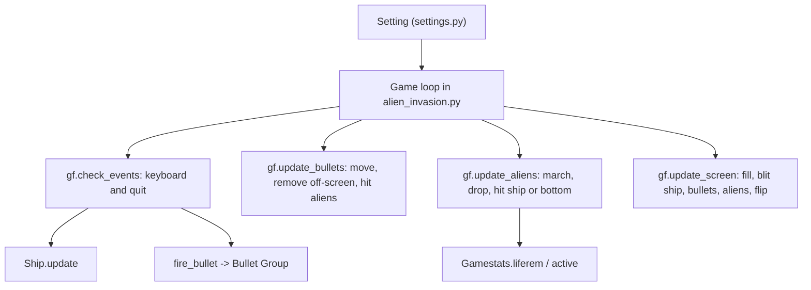

# alien_invasion_pygame — first pygame project

First and simple program with pygame:)

https://github.com/user-attachments/assets/0ef73c7b-b76b-4c90-be9d-eaa8d7d248fe

A Space-Invaders-style game — my first program with Pygame — plus a few smaller pygame experiments kept in the same folder.

## What it does

- `alien_invasion.py` — the main game: a ship at the bottom moves left/right with the arrow keys, fires up to 3 bullets with space, a fleet of aliens marches across and drops down, and the game tracks remaining lives (3) in `Gamestats`. `q` quits.
- `settings.py` — screen size 1200x800, speeds, bullet size/colour, `bullets_allowed`, `alien_speedf`, `life`.
- `game_functions.py` — event handling, fleet creation, bullet/alien updates and collisions, screen redraw.
- `ship.py`, `alien.py`, `bullet.py`, `gamestats.py` — the sprite and state classes.
- Side experiments: `side_shooter.py` + `ak47.py` + `gf.py` (a gun that moves up and down on the left edge), `catch_ball.py` + `player.py` + `ball.py` (catch falling balls), `dattebayo.py` + `naruto.py` (draws a character sprite), `12-4.py` (prints key events).
- `*.bmp` — the sprite images (`ship`, `alien`, `rock`, `sage`, `sagee`).

## How it works



## Getting started

```bash
pip install pygame
python alien_invasion.py
```

The scripts load sprites from `images/...` (and the side experiments from `image/...`), but the `.bmp` files sit in the repo root, so either create those folders and move the images in or edit the paths in `ship.py`, `alien.py`, `naruto.py`, `ak47.py`, `player.py`, `ball.py` before running.

## Status and limitations

- Learning project; no tests, no requirements file, no scoring or levels.
- Image paths do not match the repo layout (see above); `ball.py` and `ak47.py` reference `download.jpg` and `ak.bmp`, which are not in the repo.
- No license file.
